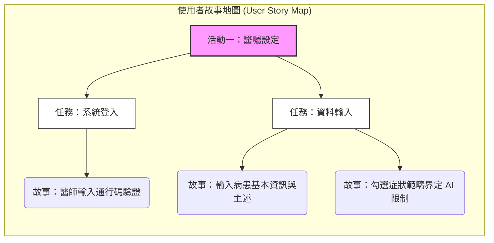
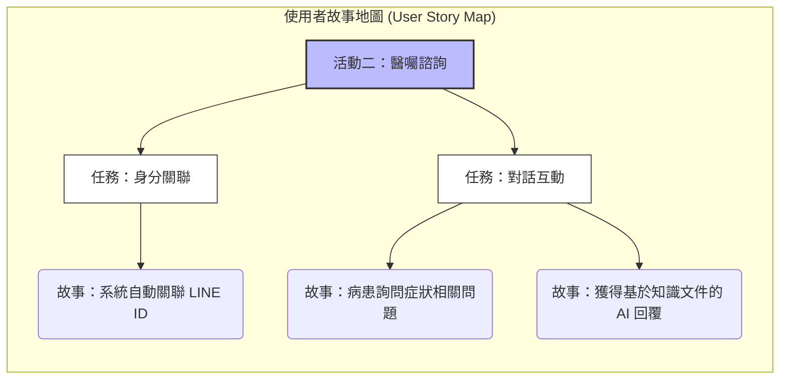
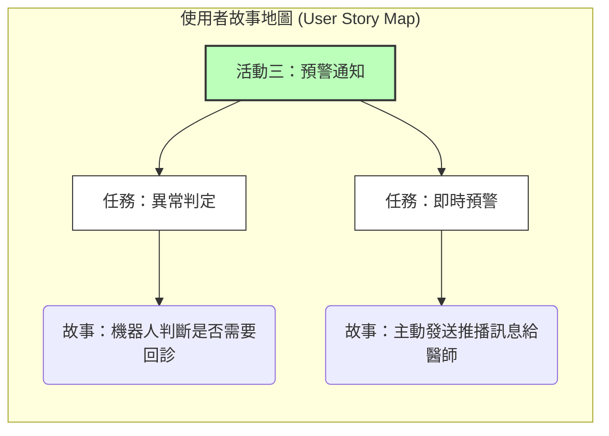
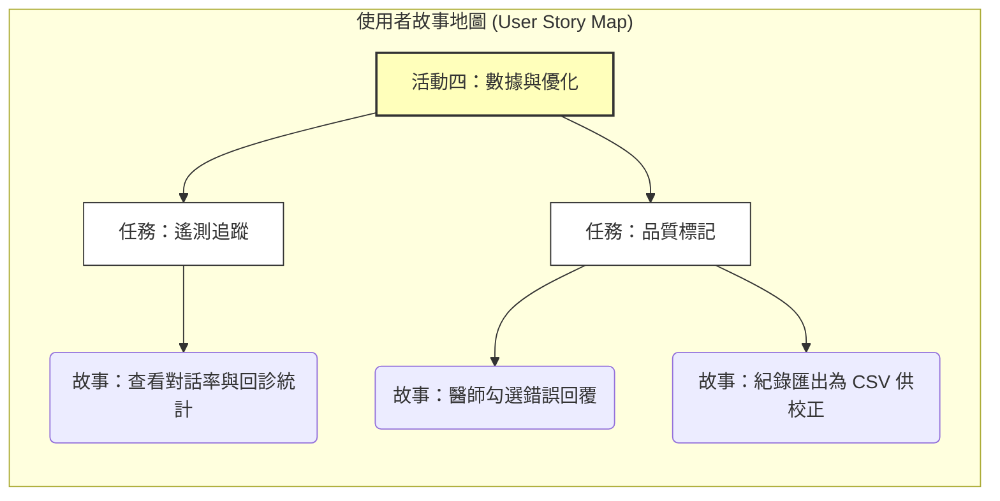

Viewed SRD.md:1-65

根據 **EDDI Chatbot SRD** 的內容，我為您整理了這份 **使用者故事地圖 (User Story Map)**。這份地圖將系統功能拆解為四大活動領域，並詳細描述了不同角色的操作流程與價值。

### 使用者故事地圖描述

1.  **活動一：病患醫囑範疇設定 (醫師端)**
    *   **任務**：身分驗證、輸入病患資料、界定衛教範圍。
    *   **價值**：確保機器人的回答僅限於該病患特定的醫療範疇，並防止非授權存取。

2.  **活動二：醫囑諮詢互動 (病患端)**
    *   **任務**：身分自動關聯、對話詢問、獲取 RAG 回覆。
    *   **價值**：讓病患能隨時隨地獲取精準且符合醫囑的衛教解答，減輕急診後的焦慮。

3.  **活動三：主動預警與通知 (系統/醫師端)**
    *   **任務**：回診需求判定、即時訊息推播。
    *   **價值**：在病患出現異常或需要回診時，第一時間主動告知醫師，強化醫病聯繫。

4.  **活動四：數據分析與系統優化 (醫師/技術端)**
    *   **任務**：查看遙測數據、回診統計、標記錯誤回覆。
    *   **價值**：透過臨床反饋優化 AI 表現，並掌握病患在院外的恢復追蹤狀況。

---

### Mermaid 流程圖

這份地圖清楚地展示了從醫師設定、病患互動到最後的數據回饋閉環。您可以將此 Mermaid 代碼直接貼到 Markdown 閱讀器中渲染查看。