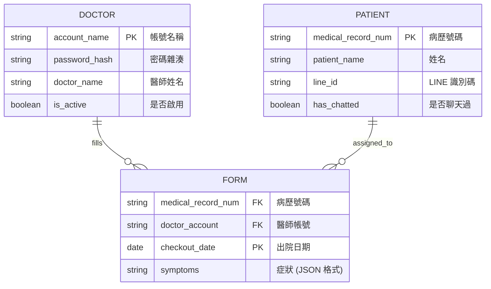

# EDDI Chatbot 軟體需求規格書 (Software Requirements Document)

## 1. 專案概述 (Project Overview)

### 1.1 專案目標 (Goals)
本專案旨在開發一個名為 **EDDI (Emergency Department Discharge Information) Chatbot** 的 LINE 聊天機器人系統，主要目標如下：
*   **病患端**：透過對話式介面，協助病患理解急診後的出院醫囑（Discharge Instructions），提高醫囑遵從性及自我照顧能力。
*   **醫師端**：提供一個可控的範疇設定工具，讓醫師能快速指定特定病患的衛教範圍，並透過後台數據追蹤病患狀況與系統準確度。
*   **主動預警**：當系統判斷病患可能需要回診時，即時通知醫療團隊，作為第一線的數位分流與警示工具。

---

## 2. 功能需求 (Functional Requirements)

### 2.1 病患端 (Patient Side)
*   **互動式衛教對話**：
    *   病患可針對醫師指定的症狀範疇，向機器人詢問相關出院醫囑內容。
    *   機器人回覆須基於醫師提供的知識文件，而非發散性的醫學常識。
*   **語系支援**：系統介面與機器人對話內容僅支援 **繁體中文**。

### 2.2 醫師端 (Doctor Side)
*   **醫囑範疇設定表單**：
    *   醫師可輸入病患資訊：出院日期、主治醫師、病歷號碼 (Medical Record Number)。
    *   **症狀勾選**：醫師可多選特定症狀標記，以界定機器人的回答範疇。
    *   **身分驗證**：進入表單頁面需輸入共用的 **通行碼 (Passcode)**，以防止病患誤入設定頁面。
*   **遙測數據後台 (Telemetry Dashboard)**：
    *   網頁介面供醫師/管理員查看系統運作紀錄。
    *   **帳號管理**：管理員可透過網頁啟用或停用 (Activate/Deactivate) 醫師帳號。
    *   **回診次數統計**：以「特定病患在系統中的表單總數減一」作為重複就醫之估計依據。
    *   **聊天機器人使用率**：統計「已填寫表單」與「實際有開始對話」的比例。
    *   **對話回顧**：醫師可於後台根據病歷號碼與日期篩選並查看對話歷史紀錄。
*   **即時通知服務**：
    *   若聊天機器人在對話中建議病患「需要回診」，系統需立即向醫師推送訊息通知（Push Alert）。

### 2.3 系統後端與機器人邏輯 (Backend & Bot Logic)
*   **RAG (檢索增強生成) 限制**：
    *   機器人需根據醫師在表單中選定的範圍，動態將相關知識文件導入 System Prompt。
    *   機器人回覆邏輯僅限於醫師指定的知識範疇。
*   **數據關聯 (Mapping)**：
    *   系統需自動將 LINE Friend ID 與資料庫中的病患病歷號碼 (Medical Record Number) 進行對應關聯。
*   **數據追蹤**：
    *   **資料庫與檔案存儲**：系統資料（如醫師、病患、表單資訊）存儲於 SQLite 資料庫。對話紀錄（Chatlog）為本地 JSON 檔案存儲，路徑為 `chat_logs/{medical_record_num}/{date}_{chat_session}.json`。
    *   **使用偵測與對話階段 (Session) 判定**：
        *   當系統收到病患的第一則訊息時，自動將該病患 (`PATIENT`) 的 `has_chatted` 狀態設為 True。
        *   `chat_session` 為從 `00` 開始的兩位數遞增數字（例如：`00`、`01` 等）。
        *   若新病患訊息與上一則病患訊息的時間間隔超過 1 小時，則判定為新的對話階段 (New Session)，並遞增 `chat_session`。

---

## 3. 非功能需求 (Non-Functional Requirements)

### 3.1 效能與可用性
*   **回應速度**：LINE Bot 回覆時間需控制在 **5 秒內**。
*   **可用性**：系統需具備 24/7 全天候運作之潛力。

### 3.2 數據處理與隱私 (Privacy & Data Handling)
*   **LLM 隱私保護**：
    *   嚴格禁止將病患姓名、ID 等個人識別資訊 (PII) 傳送至外部 LLM API。
    *   傳送至 LLM 的內容僅限於「病患症狀描述」與「醫療知識文件」。
*   **本地化存儲**：
    *   所有病患病歷號與系統資料存儲於醫院內部伺服器之資料庫中，對話紀錄以 JSON 檔案形式存儲於本地。
*   **存儲方式**：
    *   系統資料庫採用 **SQLite** 關聯式資料庫系統。
    *   對話紀錄（Chatlog）在本地以 JSON 檔案存儲，路徑為 `chat_logs/{medical_record_num}/{date}_{chat_session}.json`。

---

## 4. 技術規格與資料庫設計 (Technical Specs & DB Design)

### 4.1 實體關聯圖 (ER Diagram)

### 4.2 技術棧
*   **資料庫**：SQLite 3
*   **部署環境**：醫院內部伺服器。
*   **外部依賴**：LINE Messaging API, Google Gemini API。
*   **網頁伺服器**：Nginx
*   **前端框架**：React (用於醫師端後台)
*   **後端框架**：Python Flask

---

## 5. 未來展望 (Future Scope)

*   **跨科別擴充**：系統架構需保持靈活性，以便未來可導入其他醫療科別（如內科、外科等）的專屬醫囑知識庫。
*   **系統優化**：根據累積之對話數據與臨床回饋，持續精進 LLM 的 Prompt Engineering。
